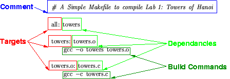
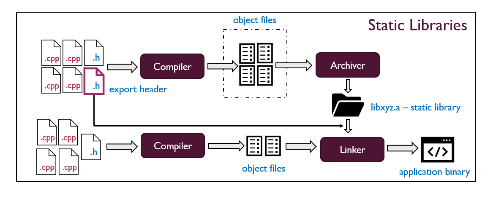
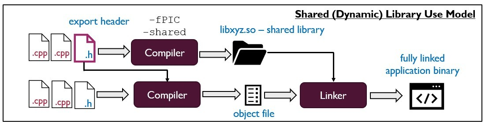

# General Knowledge

## 1. Introduction to Makefile
### 1.1. What is Makefile? 
- Makefile is a script used by the make build system to automate the compilation and management of projects. It contains:
  + Project structure information (files and their dependencies).
  + Commands for compiling, linking, and cleaning up files.
  + Rules that define how files should be generated.
- The make program reads the Makefile, determines which files need to be updated, and executes the necessary commands to build the project efficiently.
- **Naming Conventions:**
  + `Makefile` (recommended, as `make` searches for this by default).
  + `makefile` (less common but still works).
  + `*.mk` (used in modular or included Makefiles).

<p align="center">
    
</p>

### 1.2. How to run make?
- The `make` command executes **shell commands** in Linux to update one or more **target files** (typically a program or an executable).
- If the `-f` option is not provided, **make** automatically looks for a file named **Makefile** or **makefile** in the current directory.
- It checks **dependencies** and executes the required commands **only if changes** are detected, optimizing the build process.
- For more details, refer to the manual: `man make`
```
make [-f makefile] [options] ... [targets] ...
```
`[options]`
- `-f File` : Use file as a makefile  
- `-i` : Ignore all errors in commands executed to remake files.  
- `-n` : Print the commands that would be executed, but do not execute them.

**`[targets]`**
- **all**: make all the top-level targets the make file know about  
- **info**: Information of program  
- **clean**: Delete all files that are normally created by running make  
- **install**: Copy the executable file into directory that users typically search for commands  
- **uninstall**: Vice versa  
- **tar**: Create a tar file of the source files  
- **test**: Perform self tests on the program this Makefile builds.

### 1.3. Variables in Makefile
**Why Use Variables?**
- Variables help **generalize** the `Makefile`, avoiding hardcoding specific file names.
- They make the `Makefile` **easier to modify and maintain**.
- To access the value of a variable, use the syntax: `$(VARIABLE_NAME)`
- We can print the value of a variable using an echo command inside a special target:
```  
  print:
      echo $(CFLAGS)
```

**Common Compiler & Linker Flags**
```
  CFLAGS += -I./include -DDEBUG -Wall -g
  LDFLAGS += -L./lib -lm
```
- `CFLAGS`: Flags passed to the C compiler (gcc).
  + `I./include` → Adds `include/` as a header file search path.
  + `-DDEBUG` → Defines a preprocessor macro DEBUG.
  + `-Wall` → Enables all important warnings.
  + `-g` → Generates debugging symbols for gdb.
    
- `LDFLAGS`: Flags passed to the **linker** (`ld`).
  + `-L./lib` → Adds `lib/` as a **library search path**.
  + `-lm` → Links the **math library** (`libm.so`).

| Flags     | Meaning                                                     |
| --------- | ----------------------------------------------------------- |
| `-I`      | Include all header files (`*.h`) that followed by directory |
| `-Wall`   | Enable all warning                                          |
| `-g`      | Enable debug in `gcc` compiler                              |
| `-L./lib` | Path to library                                             |
| `-lm`     | Library’s name                                              |

**Automatic Variables**
- Automatic variables are special predefined variables in Makefile that help streamline rule definitions by referring to targets, dependencies, and commands dynamically.

| **Variable** | **Meaning**                                                     |
| ------------ | --------------------------------------------------------------- |
| `$@`         | Represents the **target name** of the current rule.             |
| `$<`         | Represents the **first prerequisite (dependency)** of the rule. |
| `$^`         | Represents **all prerequisites** of the rule.                   |
| `$?`         | Represents **prerequisites that are newer** than the target.    |
| `$*`         | Represents the **basename** of the target (without extension).  |

### 1.4. Makefile Functions
- Makefile functions are built-in utilities that process strings, manipulate files, and execute shell commands. They help make Makefiles more dynamic and reusable by avoiding hardcoded values.
- **Most Common Makefile Functions**

| **Function**                            | **Usage**                                      | **Description**                                         |
| --------------------------------------- | ---------------------------------------------- | ------------------------------------------------------- |
| `$(wildcard patten)`                    | `$(wildcard src/*.c)`                          | Finds files matching a pattern                          |
| `$(patsubst patten, replacement, text)` | `$(patsubst src/*.c, obj/%.o, $(SRC_FILES))`   | Replaces text in strings (commonly used for `.c -> .o`) |
| `$(shell command)`                      | `$(shell mkdir -p bin obj lib)`                | Executes shell commands.                                |
| `$(notdir names...)`                    | `$(notdir src/main.c)` -> `main.c`             | Extracts file names without paths.                      |
| `$(if condition, then, else)`           | `$(if $(DEBUG), echo "Debug", echo "Release")` | Implements condition logic.                             |
| `$(foreach var, list, expression)`      | `$(foreach dir, $(DIRS), mkdir -p $(dir);)`    | Loops through a list and applies an operation.          |


---
## 2. The Process of Compiling a C Program

### 2.1. Pre-processing  
The pre-processing step performs the following tasks before actual compilation:  

- **Removes comments** from the source code.  
- **Expands macros** (`#define` and `#ifdef`).  
- **Expands include files** by replacing `#include` directives with the actual contents of the header files.  
- **Processes conditional compilation statements** (`#ifdef`, `#ifndef`, `#endif`, etc.).  
- **Generates an intermediate file** with a `.i` extension, containing the transformed source code without comments and with all macros and includes expanded.  

💡 **Command**  
```sh
gcc -E source.c -o source.i
```

### 2.2. Compilation
This stage translates the preprocessed C code into assembly language.  
- Translates the preprocessed `.i` file into assembly language.
- Performs `syntax analysis` and converts `C code `into `assembly` instructions.
- The output `.s` file contains human-readable assembly code.
  
💡 **Command**  
```sh
gcc -S source.i -o source.s
```

### 2.3. Assemply
In this stage, the assembly code is converted into machine code.  
- The file `*.s` in the previous stage continues to be used for this stage by using assembler.
- The output we get is a file `.o`. This is a file containing machine language level instructions.

💡 **Command**  
```sh
gcc -c source.s -o source.o
```

### 2.4. Linking
Combining Object Files to Create an Executable  

- The linking stage is where individual **object files (`.o`)** are combined to produce a complete executable program.  
- It connects object files with **static (`.a` / `.lib`)** or **shared (`.so` / `.dll`)** libraries.  
- The final output is a **executable file** (`a.out` by default, o `.exe` on Windows).

💡 **Command**  
```sh
gcc source.o -o output_executable
````
  
---

## 3. Static Library and Shared Library in Linux
### 3.1. What is a Library?
A **library** is a collection of precompiled code that can be reused in different programs. Instead of writing the same code multiple times, developers can use libraries to improve efficiency and maintainability. Libraries are mainly divided into two types:
- **Static Library** (`.a` on Linux, `.lib` on Windows)
- **Shared Library** (`.so` on Linux, `.dll` on Windows)

### 3.2. Static Library
<p align="center">
    
</p>

#### Definition
A **static library** is a set of compiled object files (`.o`) that are linked directly into an executable during the compilation phase.

#### How It Works
- All functions from the library are copied into the executable at **compile time**.
- The resulting executable is **self-contained**, meaning it does not require external dependencies at runtime.

#### ✅ Advantages
- Faster execution time (no runtime linking).  
- No dependency on external library files at runtime.  
- Ideal for standalone applications.

#### ❌ Disadvantages
- Increases the size of the executable because it contains copies of all required functions.  
- If the library is updated, the entire program needs to be **recompiled**.  

#### Example: Creating and Using a Static Library
```sh
# Step 1: Compile source files into object files
gcc -c libmath.c -o libmath.o

# Step 2: Create the static library
ar rcs libmath.a libmath.o

# Step 3: Link the static library with an executable
gcc main.c -o main_program -L. -lmath
```

### 3.3. Shared Library

<p align="center">
    
</p>

#### Definition
A **shared library** is a collection of compiled functions that multiple programs can load at runtime.

#### How It Works
- The **linker** creates references to functions in the shared library, but does **not** copy them into the executable.
- At runtime, the **dynamic linker (`ld.so`)** loads the required library into memory.

#### ✅ Advantages
- Reduces the size of executables because the functions are not copied.  
- Multiple programs can share the same library in memory.  
- If the library is updated, all dependent programs automatically benefit without recompilation.

#### ❌ Disadvantages
- Slightly slower execution due to **dynamic linking** at runtime.  
- If the shared library is missing or incompatible, the program may fail to run.  

#### Example: Creating and Using a Shared Library
```sh
# Step 1: Compile source files as Position-Independent Code (PIC)
gcc -fPIC -c libmath.c -o libmath.o

# Step 2: Create the shared library
gcc -shared -o libmath.so libmath.o

# Step 3: Link the shared library with an executable
gcc main.c -o main_program -L. -lmath

# Step 4: Set the library path (if needed)
export LD_LIBRARY_PATH=.
```

### 3.4. Comparison Table

| **Properties**         | **Static Library** | **Shared Library** |
|------------------------|------------------|------------------|
| **Linking Time**       | Functions are copied into the executable at **compile time** (Static linking). | Functions are linked at **runtime** (Dynamic linking). |
| **Size**              | Larger executable (contains all library functions). | Smaller executable (functions are not copied). |
| **Memory Usage**      | Each executable has its own copy of the library. | Multiple programs share the same library in memory. |
| **Code Updates**      | Requires **recompilation** when the library is updated. | No need to recompile; updates apply automatically. |
| **Execution Speed**   | **Faster** because no dynamic linking is required. | **Slightly slower** due to runtime linking overhead. |
| **Dependencies**      | No external dependencies. | Requires the shared library to be present at runtime. |


### 3.5. When to Use Static vs. Shared Library?
| **Use Case** | **Preferred Library Type** |
|-------------|--------------------------|
| Standalone applications with no external dependencies | **Static Library** |
| System utilities or performance-critical software | **Static Library** |
| Large software projects with frequent updates | **Shared Library** |
| Applications that multiple programs will use | **Shared Library** |

### 3.6. Creating Libraries in Linux (Reference)
For more detailed steps and command-line instructions on creating static and shared libraries, refer to:  
👉 [Creating Libraries with GCC](https://renenyffenegger.ch/notes/development/languages/C-C-plus-plus/GCC/create-libraries/index)

---

**Previous lecture**: [[01. Basic Linux Command]]

**Next lecture:** [[02. Linux File System]]