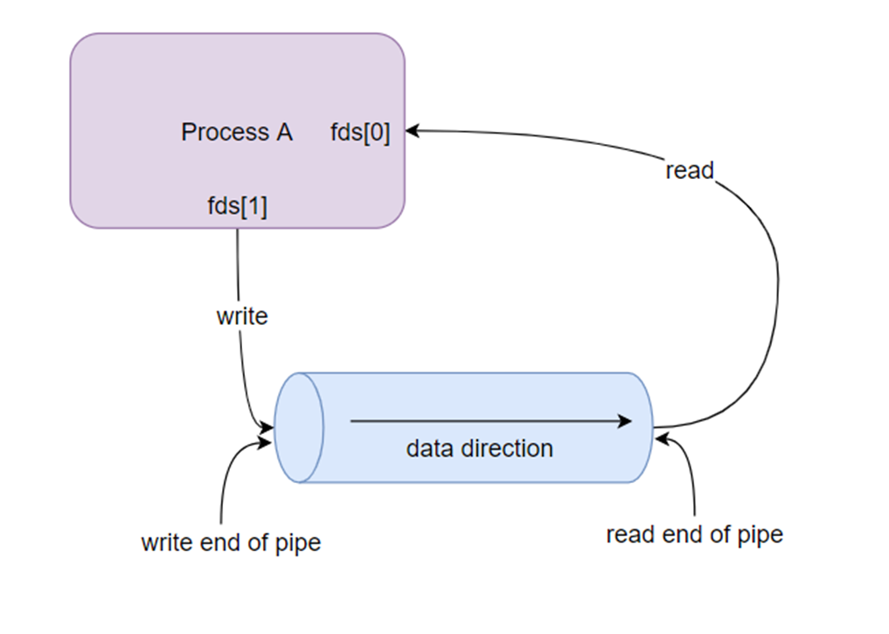
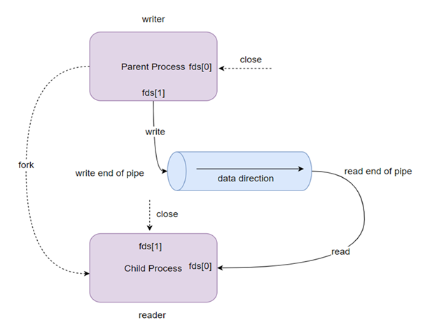
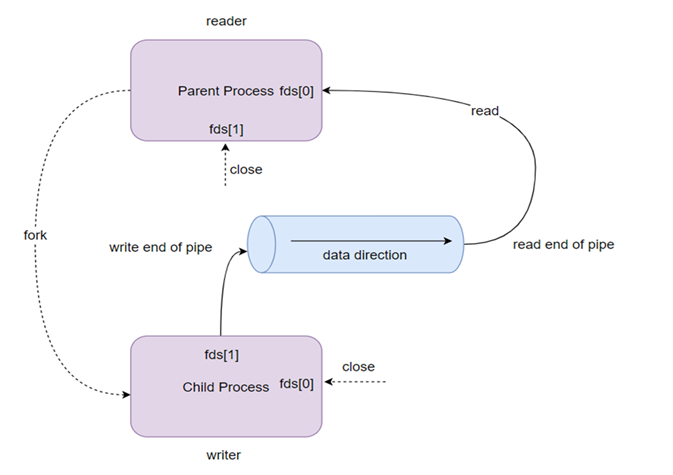

# Pipes and FIFOs
## 1. Introduction

### 1.1 Definition
- **Pipes** are one of the methods of **IPC** (Inter-Process Communication) used for inter-process communication.
- **Pipes** provide one-way communication, meaning they can only be used in a way that one process writes to the **pipe**, and another process reads from it.

### 1.2 Operation
- When a **pipe** is created, it resides in **RAM** and is treated as a **"virtual file"**.
- **Pipes** can be used during process creation.
- When a process writes to a **"virtual file"** (or effectively a **pipe**), another related process (**related-process**) can read data from it.

**Example:** A **pipe** can be thought of as a real-time scenario: water is the data poured into a **pipe** and stored in a container. Then, someone uses a cup to scoop water from that container. This means the **output** of the water (**water**) becomes the **input** of the cup (**glass**).

#### **Reading from a pipe:**
- If an attempt is made to read data from an "empty" **pipe**, the **read** end will **block** until at least 1 **byte** is read.
- If the **write** end of a pipe is closed, the **read** end will independently read all remaining data in the **pipe** and **return 0**.

#### **Pipes have a limited capacity:**
- A **pipe** has a limited buffer maintained in memory.
- This buffer has a maximum capacity. When a **pipe** is full, further data writes to the **pipe** will block until the **read** end retrieves some data from the **pipe**, allowing the **write** end to continue writing.

**Illustration:**
<p align="center">
    
</p>

- **Process A** writes data to the **pipe** via the **write end of pipe**.
- Data is transmitted in the **data direction**.
- **Process A** reads data from the **pipe** via the **read end of pipe**.

## 2. Creating and Using Pipes

### 2.1 Creating Pipes
- `pipe()`
- If a **pipe** is created before calling `fork()`, the **parent** and **child** (**related-process**) can communicate through the **pipe**.

```c
int pipe(int fds[2]);
```
- Creates a new **pipe**. Returns two **file descriptors** (fd) in **fds**.
  - `fds[0]`: **file descriptor** for **reading** from the **pipe**.
  - `fds[1]`: **file descriptor** for **writing** to the **pipe**.
- Returns 0 on success, -1 on failure.

### 2.2 Two-way Communication
- To achieve two-way communication, simply create two **pipes** to send data in each direction between two processes.
- When using this technique, care must be taken to avoid issues like **deadlock**, such as when a process attempts to read from an empty **pipe** or write to a full **pipe**.

#### **Parent as Writer, Child as Reader:**

<p align="center">
    
</p>

- **Parent Process** writes data to the **pipe** via the **write end of pipe**.
- **Child Process** reads data from the **pipe** via the **read end of pipe**.
- The **Parent** closes the **read end**, and the **Child** closes the **write end** to ensure one-way communication.

#### **Parent as Reader, Child as Writer:**

<p align="center">
    
</p>

- **Parent Process** reads data from the **pipe** via the **read end of pipe**.
- **Child Process** writes data to the **pipe** via the **write end of pipe**.
- The **Parent** closes the **write end**, and the **Child** closes the **read end** to ensure one-way communication.

## 3. FIFOs – Named Pipes

### 3.1 Definition
- **FIFOs** are an extension of **pipes**. Regular **pipes** are unnamed and only exist during the lifetime of a process.
- The key difference is that **FIFOs** have a name in the filesystem and can be opened like a regular file.
- **Named Pipes** can persist as long as the system is running, beyond the lifetime of the process.
- They can be considered a special file that is no longer in use. A **FIFO** is a special file stored in local memory, created using the `mkfifo()` function in C.

### 3.2 Creating FIFOs from Source Code
- `mkfifo()`
- A **FIFO** is a type of file, and we can use all standard system calls such as `open`, `read`, `write`, and `close`.

```c
int mkfifo(const char *pathname, mode_t mode);
```
- Creates a new **FIFO** with the specified path. Returns two **file descriptors** (fd) in **fds**.
  - `pathname`: the name of the **FIFO** file.
  - `mode`: permissions for the **FIFO** file.
- Returns 0 on success, -1 on failure.

## 4. Building a Client-Server Model with FIFOs

### Problem: Building a Client-Server Model Using FIFOs

#### S1: Establishing a Connection
- **How do clients know about the server?**
  - **Well-known address/name**:
    - Fixed location.
- **Server Identification:**
  - Provides multiple services.
  - Clients must request to register.
  - Adds overhead (cost, programming).

#### S2: Handling Connection Requests
**Server:**
- Creates a **FIFO** to handle requests.
- Processes the request message:
  - Check the key.
  - Check the service.
  - Send a connection limit.
- Sends an acknowledgment (accept/reject) for the request.

**Client:**
- Creates a **FIFO** to send and receive messages:
  - Name = TEMPLATE + PID.
- Closes the request message:
  - Name.
  - Requested service.
  - Key.
- Sends the request to the server:
  - If the server accepts → Sends the data branch.
  - If the server rejects → Destroys the FIFO.

**Note:** Multiple clients may send requests, so a single FIFO cannot be used to handle all requests.

#### S3: Handling Messages
- **Note that data in a pipe or FIFO is a stream of bytes, with no boundaries between messages explicitly marked.**
- This means that when multiple messages are sent to a process, such as a server, the sender and receiver must agree on a convention to separate the messages:
  - End each message with a delimiter character.
  - The reading process must scan the data from the FIFO byte by byte until it finds the delimiter.

**Messages include a header with a fixed size containing a length field:**
- Understand the length for messages of arbitrary size.
- Ensure the integrity of messages without using a specific format.
- Use messages with a fixed size, and the server always reads messages of this fixed size:
  - This has the advantage of being simple to program.
  - Wastes transmission channel capacity.
  - If a message does not have the correct length, all subsequent messages will be misaligned. In this case, the server cannot recover to continue.

## 5. Code Examples

### 5.1 Example: Using Pipes for Parent-Child Communication
Below is a simple C program demonstrating how a **pipe** can be used for communication between a parent and child process.

```c
#include <stdio.h>
#include <stdlib.h>
#include <unistd.h>
#include <string.h>
#include <sys/wait.h>

int main() {
    int fd[2]; // File descriptors for the pipe
    pid_t pid;
    char buf[100];
    
    // Create the pipe
    if (pipe(fd) == -1) {
        perror("pipe");
        exit(EXIT_FAILURE);
    }

    // Fork a child process
    pid = fork();
    if (pid == -1) {
        perror("fork");
        exit(EXIT_FAILURE);
    }

    if (pid == 0) { // Child process (reader)
        close(fd[1]); // Close the write end
        read(fd[0], buf, sizeof(buf)); // Read from the pipe
        printf("Child received: %s\n", buf);
        close(fd[0]); // Close the read end
    } else { // Parent process (writer)
        close(fd[0]); // Close the read end
        char *msg = "Hello from parent!";
        write(fd[1], msg, strlen(msg) + 1); // Write to the pipe
        close(fd[1]); // Close the write end
        wait(NULL); // Wait for the child to finish
    }

    return 0;
}
```

**Explanation:**
- The parent process writes a message ("Hello from parent!") to the **pipe**.
- The child process reads the message from the **pipe** and prints it.

### 5.2 Example: Using FIFOs for Client-Server Communication
Below is a simple example of a Client-Server model using **FIFOs**. This example includes a server that listens for requests and a client that sends a request.

**Server Code (server.c):**
```c
#include <stdio.h>
#include <stdlib.h>
#include <fcntl.h>
#include <sys/stat.h>
#include <unistd.h>

#define SERVER_FIFO "/tmp/server_fifo"

int main() {
    char buf[100];
    
    // Create the server FIFO
    if (mkfifo(SERVER_FIFO, 0666) == -1) {
        perror("mkfifo");
        exit(EXIT_FAILURE);
    }

    printf("Server: Waiting for requests...\n");
    int fd = open(SERVER_FIFO, O_RDONLY);
    if (fd == -1) {
        perror("open");
        exit(EXIT_FAILURE);
    }

    // Read the request from the client
    read(fd, buf, sizeof(buf));
    printf("Server: Received request: %s\n", buf);
    close(fd);

    // Clean up
    unlink(SERVER_FIFO);
    return 0;
}
```

**Client Code (client.c):**
```c
#include <stdio.h>
#include <stdlib.h>
#include <fcntl.h>
#include <sys/stat.h>
#include <unistd.h>

#define SERVER_FIFO "/tmp/server_fifo"

int main() {
    int fd;
    char *msg = "Hello, Server! This is a request.";

    // Open the server FIFO for writing
    fd = open(SERVER_FIFO, O_WRONLY);
    if (fd == -1) {
        perror("open");
        exit(EXIT_FAILURE);
    }

    // Send the request to the server
    write(fd, msg, strlen(msg) + 1);
    printf("Client: Sent request: %s\n", msg);
    close(fd);

    return 0;
}
```

**Explanation:**
- The server creates a **FIFO** (`/tmp/server_fifo`) and waits for requests.
- The client opens the **FIFO** and sends a request message to the server.
- The server reads the request and prints it.

## 6. Comparison with Other IPC Methods

| **Method**       | **Pipes/FIFOs**                     | **Sockets**                     | **Shared Memory**               | **Message Queues**              |
|------------------|-------------------------------------|---------------------------------|---------------------------------|---------------------------------|
| **Communication** | One-way (Pipes), Two-way (FIFOs)   | Two-way                        | Two-way                        | One-way (queue-based)          |
| **Persistence**  | Pipes: Process lifetime, FIFOs: System lifetime | System lifetime                | Process lifetime               | System lifetime                |
| **Speed**        | Moderate                           | Slower (network overhead)      | Fastest (direct memory access) | Moderate                       |
| **Use Case**     | Simple process communication       | Network communication          | High-speed data sharing        | Message passing between processes |

**When to Use Pipes/FIFOs:**
- Use **Pipes** for simple parent-child communication.
- Use **FIFOs** for communication between unrelated processes or when persistence is needed.

## 7. Error Handling

When working with **Pipes** and **FIFOs**, error handling is crucial to ensure robust programs. Common errors include:
- **pipe() failure:** Check the return value of `pipe()`. If it returns -1, use `perror()` to print the error (e.g., "Too many file descriptors").
- **mkfifo() failure:** If `mkfifo()` fails, it might be due to a file already existing or insufficient permissions.
- **Read/Write errors:** Ensure the pipe/FIFO is not closed prematurely. Use `errno` to diagnose issues like `EPIPE` (broken pipe).

**Example of Error Handling:**
```c
if (pipe(fd) == -1) {
    perror("pipe failed");
    exit(EXIT_FAILURE);
}
```

## 8. Performance and Limitations

- **Performance:** **Pipes** and **FIFOs** are relatively efficient for small to medium data transfers. However, they are slower than **Shared Memory** because data must be copied between user space and kernel space.
- **Limitations:**
  - **Pipes** have a limited buffer size (typically 64KB on modern systems). Writing to a full pipe will block.
  - **FIFOs** can be slower for large data transfers due to filesystem overhead.
  - Not suitable for high-performance applications requiring massive data throughput.

## 9. Real-world Applications

- **Unix/Linux Shell:** **Pipes** are widely used in Unix/Linux for command chaining, e.g., `ls | grep "file"`, where the output of `ls` is piped as input to `grep`.
- **System Logging:** **FIFOs** are used in logging systems where a process writes logs to a FIFO, and another process reads and processes them.
- **Embedded Systems:** **Pipes** and **FIFOs** are used in embedded systems for lightweight inter-process communication between components.

---

- **Previous lecture**: [Socket](06.%20Socket.md)
- **Next lecture:** [Message Queue](08.%20Message%20Queue.md)