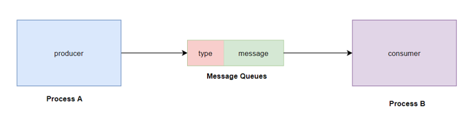
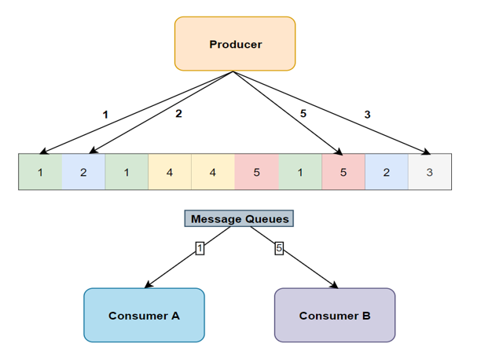

# Message Queue

## 1. What are Message Queues?

Message queues are kernel-managed linked lists of messages, enabling structured data exchange between processes. Unlike pipes (raw byte streams), messages are tagged with types (System V) or priorities (POSIX), allowing selective retrieval. Messages within the same priority or type are queued in FIFO order.

<p align="center">
    
</p>

*Diagram*: Depicts a kernel-maintained linked list of messages, each with a type/priority and data payload.

**Embedded Consideration**: Message queues consume kernel memory, so configure `msg_qbytes` (System V) or `mq_maxmsg`/`mq_msgsize` (POSIX) to avoid exhausting resources on devices with limited RAM (e.g., 16 MB).

<p align="center">
    
</p>

*Diagram*: Shows an example of processes exchanging messages via a queue, highlighting sender and receiver interactions.

### 1.1. Advantages of Message Queues

- **Asynchronous Communication**: Sender and receiver operate independently, ideal for event-driven embedded systems.
- **Message-Oriented**: Discrete messages simplify parsing compared to streams.
- **Message Types/Priorities**: Enable selective retrieval, useful for prioritizing critical messages (e.g., emergency alerts).
- **System-Managed Storage**: Kernel handles buffering, reducing user-space complexity.
- **Multiple Readers/Writers**: Supports concurrent access by multiple processes.

### 1.2. Limitations of Message Queues

- **Size Limitations**: System-dependent maximum message size and queue length (e.g., `/proc/sys/kernel/msgmax` for System V).
- **Persistent Resources**: Queues persist until removed, risking leaks if not cleaned up, especially in embedded systems with frequent reboots.
- **No Network Support**: Limited to a single system; for distributed embedded systems (e.g., IoT), use sockets or MQTT.
- **Kernel Overhead**: Higher latency than shared memory, a concern for real-time tasks.

---

## 2. System V Message Queues

System V message queues are a traditional IPC mechanism using integer keys. They’re less common in modern embedded Linux due to complexity but may appear in legacy codebases.

### 2.1. Implementation Steps

1. Create a key.
2. Create or open a message queue.
3. Write data to the queue.
4. Read data from the queue.
5. Release the queue to prevent resource leaks.

**Embedded Note**: Always remove queues with `IPC_RMID` to avoid persistent resources, as embedded devices may reboot frequently, leaving stale queues.

### 2.2. Creating a Key

Use `ftok()` to generate a unique key:

```c
#include <sys/ipc.h>
key_t ftok(const char *pathname, int proj);
```

- **Parameters**:
    - `pathname`: Existing, accessible file (e.g., `/tmp/myfile`).
    - `proj`: Project identifier (e.g., 'A').
- **Returns**: Integer key or -1 on error.
- Combines file inode and project ID for uniqueness.

### 2.3. Creating a Message Queue

Use `msgget()` to create or open a queue:

```c
#include <sys/types.h>
#include <sys/msg.h>
int msgget(key_t key, int msgflg);
```

- **Parameters**:
    - `key`: From `ftok()`.
    - `msgflg`: Flags like `IPC_CREAT` (create if non-existent), `IPC_EXCL` (fail if exists), and permissions (e.g., 0666).
- **Returns**: Queue ID or -1 on error.

### 2.4. Writing to a Message Queue

Use `msgsnd()` to send a message:

```c
#include <sys/types.h>
#include <sys/msg.h>
int msgsnd(int msqid, const void *msgp, size_t msgsz, int msgflg);
```

- **Parameters**:
    - `msqid`: Queue ID from `msgget()`.
    - `msgp`: Pointer to a `struct msgbuf`:
        
        ```c
        struct msgbuf {
            long mtype;     /* message type, must be > 0 */
            char mtext[1];  /* message data */
        };
        ```
        
    - `msgsz`: Size of `mtext` (excludes `mtype`).
    - `msgflg`: `IPC_NOWAIT` (non-blocking) or 0 (block until space).
- **Returns**: 0 on success, -1 on error (e.g., `ENOSPC` if queue is full).

### 2.5. Reading from a Message Queue

Use `msgrcv()` to receive a message:

```c
#include <sys/types.h>
#include <sys/msg.h>
ssize_t msgrcv(int msqid, void *msgp, size_t msgsz, long msgtyp, int msgflg);
```

- **Parameters**:
    - `msqid`: Queue ID.
    - `msgp`: Buffer for received message.
    - `msgsz`: Maximum size of `mtext`.
    - `msgtyp`: 0 (first message), >0 (specific type), <0 (lowest type ≤ |msgtyp|).
    - `msgflg`: `IPC_NOWAIT` (non-blocking), `MSG_NOERROR` (truncate oversized messages).
- **Returns**: Bytes copied to `mtext` or -1 on error (e.g., `EIDRM` if queue removed).

### 2.6. Controlling and Deleting a Message Queue

Use `msgctl()` for queue operations:

```c
#include <sys/types.h>
#include <sys/msg.h>
int msgctl(int msqid, int cmd, struct msqid_ds *buf);
```

- **Parameters**:
    - `msqid`: Queue ID.
    - `cmd**:` IPC_RMID`(remove queue),`IPC_STAT`(get info),`IPC_SET` (set attributes).
    - `buf`: Pointer to `msqid_ds`:
        
        ```c
        struct msqid_ds {
            struct ipc_perm msg_perm;   /* Permissions */
            time_t msg_stime;           /* Last msgsnd() time */
            time_t msg_rtime;           /* Last msgrcv() time */
            time_t msg_ctime;           /* Last change time */
            unsigned long msg_cbytes;   /* Bytes in queue */
            msgqnum_t msg_qnum;         /* Number of messages */
            msglen_t msg_qbytes;        /* Max bytes in queue */
            pid_t msg_lspid;            /* Last msgsnd() PID */
            pid_t msg_lrpid;            /* Last msgrcv() PID */
        };
        ```
        
- **Returns**: 0 on success, -1 on error.

### 2.7. Example: System V Message Queue

**Sender Program**:

```c
#include <stdio.h>
#include <stdlib.h>
#include <string.h>
#include <unistd.h>
#include <sys/types.h>
#include <sys/ipc.h>
#include <sys/msg.h>
#include <errno.h>

#define MAX_SIZE 512

struct msg_buffer {
    long msg_type;
    char msg_text[MAX_SIZE];
};

int main() {
    key_t key;
    int msgid;
    struct msg_buffer message;

    // Create key
    key = ftok("message_queue_file", 65);
    if (key == -1) {
        perror("ftok failed");
        exit(EXIT_FAILURE);
    }

    // Create/open queue
    msgid = msgget(key, 0666 | IPC_CREAT);
    if (msgid == -1) {
        perror("msgget failed");
        exit(EXIT_FAILURE);
    }

    // Get input
    message.msg_type = 1;
    printf("Enter message to send: ");
    if (fgets(message.msg_text, MAX_SIZE, stdin) == NULL) {
        perror("fgets failed");
        exit(EXIT_FAILURE);
    }

    // Remove trailing newline
    size_t len = strlen(message.msg_text);
    if (len > 0 && message.msg_text[len-1] == '\n') {
        message.msg_text[len-1] = '\0';
    }

    // Send message
    if (msgsnd(msgid, &message, strlen(message.msg_text) + 1, 0) == -1) {
        if (errno == ENOSPC) {
            fprintf(stderr, "Error: Message queue is full\n");
        } else {
            perror("msgsnd failed");
        }
        exit(EXIT_FAILURE);
    }

    printf("Message sent: %s\n", message.msg_text);
    return 0;
}
```

**Receiver Program**:

```c
#include <stdio.h>
#include <stdlib.h>
#include <unistd.h>
#include <sys/types.h>
#include <sys/ipc.h>
#include <sys/msg.h>
#include <errno.h>

#define MAX_SIZE 512

struct msg_buffer {
    long msg_type;
    char msg_text[MAX_SIZE];
};

int main() {
    key_t key;
    int msgid;
    struct msg_buffer message;

    // Create key
    key = ftok("message_queue_file", 65);
    if (key == -1) {
        perror("ftok failed");
        exit(EXIT_FAILURE);
    }

    // Open queue
    msgid = msgget(key, 0666 | IPC_CREAT);
    if (msgid == -1) {
        perror("msgget failed");
        exit(EXIT_FAILURE);
    }

    // Get queue info
    struct msqid_ds qinfo;
    if (msgctl(msgid, IPC_STAT, &qinfo) == -1) {
        perror("msgctl failed");
        exit(EXIT_FAILURE);
    }
    printf("Current number of messages in queue: %lu\n", qinfo.msg_qnum);

    // Receive message
    ssize_t recv_size = msgrcv(msgid, &message, MAX_SIZE, 1, 0);
    if (recv_size == -1) {
        if (errno == EIDRM) {
            fprintf(stderr, "Error: Message queue was removed\n");
        } else {
            perror("msgrcv failed");
        }
        exit(EXIT_FAILURE);
    }

    printf("Message received: %s\n", message.msg_text);

    // Remove queue
    if (msgctl(msgid, IPC_RMID, NULL) == -1) {
        perror("msgctl failed to remove queue");
        exit(EXIT_FAILURE);
    }

    printf("Message queue removed successfully\n");
    return 0;
}
```

**Embedded Note**: Check for `ENOSPC` and `EIDRM` errors, as queues may fill up or be removed unexpectedly in dynamic embedded workloads. Use `ipcs -q` to debug active queues.

---

## 3. POSIX Message Queues

POSIX message queues offer a modern, file-like API with priority support, making them ideal for embedded systems, especially real-time applications.

### 3.1. Implementation Steps

1. Create or open a message queue.
2. Write data to the queue.
3. Read data from the queue.
4. Close the queue.
5. Remove the queue when no longer needed.

**Embedded Note**: Tune `mq_maxmsg` and `mq_msgsize` (e.g., 10 messages, 128 bytes) to conserve memory in resource-constrained devices.

### 3.2. Opening a Message Queue

Use `mq_open()` to create or open a queue:

```c
#include <fcntl.h>
#include <sys/stat.h>
#include <mqueue.h>
mqd_t mq_open(const char *name, int oflag);
mqd_t mq_open(const char *name, int oflag, mode_t mode, struct mq_attr *attr);
```

- **Parameters**:
    - `name`: Queue name (e.g., `/myqueue`).
    - `oflag**:` O_CREAT`,` O_EXCL`,` O_RDONLY`,` O_WRONLY`,` O_RDWR`,` O_NONBLOCK`.
    - `mode`: Permissions (e.g., 0660) for new queues.
    - `attr`: Queue attributes or NULL for defaults.
- **Returns**: Queue descriptor or (mqd_t)-1 on error.
- **Attributes**:

```c
struct mq_attr {
    long mq_flags;    /* Flags: 0 or O_NONBLOCK */
    long mq_maxmsg;   /* Max number of messages */
    long mq_msgsize;  /* Max message size (bytes) */
    long mq_curmsgs;  /* Current number of messages */
};
```

**Embedded Note**: POSIX queues appear in `/dev/mqueue`, so verify filesystem limits via `/proc/sys/fs/mqueue/msg_max`.

### 3.3. Sending a Message

Use `mq_send()` to send a message:

```c
#include <mqueue.h>
int mq_send(mqd_t mqdes, const char *msg_ptr, size_t msg_len, unsigned int msg_prio);
```

- **Parameters**:
    - `mqdes`: Queue descriptor.
    - `msg_ptr`: Message buffer.
    - `msg_len`: Message length (≤ `mq_msgsize`).
    - `msg_prio`: Priority (higher = more urgent).
- **Returns**: 0 on success, -1 on error.
- Messages with equal priority are FIFO-ordered.

### 3.4. Receiving a Message

Use `mq_receive()` to read a message:

```c
#include <mqueue.h>
ssize_t mq_receive(mqd_t mqdes, char *msg_ptr, size_t msg_len, unsigned int *msg_prio);
```

- **Parameters**:
    - `mqdes`: Queue descriptor.
    - `msg_ptr`: Buffer for message.
    - `msg_len`: Buffer size (≥ `mq_msgsize`).
    - `msg_prio`: Stores received message priority (or NULL).
- **Returns**: Bytes received or -1 on error.
- Always retrieves the highest-priority message.

### 3.5. Closing a Message Queue

Use `mq_close()` to close a queue:

```c
#include <mqueue.h>
int mq_close(mqd_t mqdes);
```

- **Parameters**: `mqdes` from `mq_open()`.
- **Returns**: 0 on success, -1 on error.
- Doesn’t remove the queue; other processes can still access it.

### 3.6. Removing a Message Queue

Use `mq_unlink()` to delete a queue:

```c
#include <mqueue.h>
int mq_unlink(const char *name);
```

- **Parameters**: Queue name.
- **Returns**: 0 on success, -1 on error.
- Queue persists until all descriptors are closed.

### 3.7. Example: POSIX Message Queue

**Sender Program**:

```c
#include <stdio.h>
#include <stdlib.h>
#include <string.h>
#include <fcntl.h>
#include <sys/stat.h>
#include <mqueue.h>
#include <unistd.h>
#include <errno.h>

#define QUEUE_NAME "/test_queue"
#define MAX_SIZE 128
#define QUEUE_PERMISSIONS 0660
#define MAX_MESSAGES 10

int main() {
    mqd_t mq;
    struct mq_attr attr;
    char buffer[MAX_SIZE + 1];
    int must_stop = 0;

    // Set attributes
    attr.mq_flags = 0;
    attr.mq_maxmsg = MAX_MESSAGES;
    attr.mq_msgsize = MAX_SIZE;
    attr.mq_curmsgs = 0;

    // Create queue
    mq = mq_open(QUEUE_NAME, O_CREAT | O_WRONLY, QUEUE_PERMISSIONS, &attr);
    if (mq == (mqd_t)-1) {
        perror("mq_open failed");
        exit(EXIT_FAILURE);
    }

    do {
        printf("Enter message (or empty to quit): ");
        if (fgets(buffer, MAX_SIZE, stdin) == NULL) {
            perror("fgets failed");
            break;
        }

        size_t len = strlen(buffer);
        if (len > 0 && buffer[len-1] == '\n') {
            buffer[len-1] = '\0';
        }

        if (strlen(buffer) == 0) {
            must_stop = 1;
        } else {
            if (mq_send(mq, buffer, strlen(buffer) + 1, 1) == -1) {
                perror("mq_send failed");
                break;
            }
            printf("Message sent: %s\n", buffer);
        }
    } while (!must_stop);

    if (mq_close(mq) == -1) {
        perror("mq_close failed");
        exit(EXIT_FAILURE);
    }

    printf("Queue closed\n");
    return 0;
}
```

**Receiver Program (Non-Blocking)**:

```c
#include <stdio.h>
#include <stdlib.h>
#include <string.h>
#include <fcntl.h>
#include <sys/stat.h>
#include <mqueue.h>
#include <unistd.h>
#include <errno.h>
#include <signal.h>

#define QUEUE_NAME "/test_queue"
#define MAX_SIZE 128
#define MAX_MESSAGES 10

volatile sig_atomic_t done = 0;

void handle_signal(int sig) {
    done = 1;
}

int main() {
    mqd_t mq;
    struct mq_attr attr;
    char buffer[MAX_SIZE + 1];
    unsigned int prio;
    ssize_t bytes_read;

    // Signal handling
    struct sigaction sa;
    sa.sa_handler = handle_signal;
    sa.sa_flags = 0;
    sigemptyset(&sa.sa_mask);
    sigaction(SIGINT, &sa, NULL);

    // Open queue (non-blocking)
    mq = mq_open(QUEUE_NAME, O_RDONLY | O_NONBLOCK);
    if (mq == (mqd_t)-1) {
        perror("mq_open failed");
        exit(EXIT_FAILURE);
    }

    // Get attributes
    if (mq_getattr(mq, &attr) == -1) {
        perror("mq_getattr failed");
        mq_close(mq);
        exit(EXIT_FAILURE);
    }
    printf("Queue \"%s\":\n  Max messages: %ld\n  Max size: %ld\n  Current messages: %ld\n",
           QUEUE_NAME, attr.mq_maxmsg, attr.mq_msgsize, attr.mq_curmsgs);

    printf("Waiting for messages (Ctrl+C to quit)...\n");

    while (!done) {
        bytes_read = mq_receive(mq, buffer, MAX_SIZE, &prio);
        if (bytes_read == -1) {
            if (errno == EAGAIN) {
                usleep(100000); // Wait 100ms before retrying
                continue;
            } else if (errno == EINTR) {
                continue;
            }
            perror("mq_receive failed");
            break;
        }

        buffer[bytes_read] = '\0';
        printf("Received (priority %u): %s\n", prio, buffer);

        if (strncmp(buffer, "quit", 4) == 0) {
            break;
        }
    }

    if (mq_close(mq) == -1) {
        perror("mq_close failed");
    }

    if (mq_unlink(QUEUE_NAME) == -1) {
        perror("mq_unlink failed");
    }

    printf("Queue removed\n");
    return 0;
}
```

**Embedded Note**: The receiver uses `O_NONBLOCK` for event-driven polling, suitable for embedded main loops. Check `/proc/sys/fs/mqueue` limits to ensure queue creation succeeds.

### 3.8. Asynchronous Notification

POSIX queues support notifications when messages arrive:

```c
#include <mqueue.h>
#include <signal.h>

struct sigevent sev;
sev.sigev_notify = SIGEV_SIGNAL;
sev.sigev_signo = SIGUSR1;
sev.sigev_value.sival_ptr = &mq;

if (mq_notify(mq, &sev) == -1) {
    perror("mq_notify");
    exit(EXIT_FAILURE);
}

void handle_message(int sig, siginfo_t *info, void *context) {
    mqd_t *mqdes = info->si_value.sival_ptr;
    mq_notify(*mqdes, &sev); // Re-register
    // Read message...
}
```

**Embedded Note**: Signal-based notifications may be unreliable in minimal libc implementations. Consider polling or threads for simpler systems.

### 3.9. Timed Message Operations

Support for timeouts in sending/receiving:

```c
#include <mqueue.h>
#include <time.h>

struct timespec timeout;
clock_gettime(CLOCK_REALTIME, &timeout);
timeout.tv_sec += 5;

ssize_t bytes = mq_timedreceive(mq, buffer, MAX_SIZE, &prio, &timeout);
if (bytes == -1) {
    if (errno == ETIMEDOUT) {
        printf("Timed out waiting for message\n");
    } else {
        perror("mq_timedreceive");
    }
}

if (mq_timedsend(mq, buffer, strlen(buffer) + 1, 1, &timeout) == -1) {
    if (errno == ETIMEDOUT) {
        printf("Timed out waiting to send\n");
    } else {
        perror("mq_timedsend");
    }
}
```

**Embedded Note**: Timed operations are useful for real-time systems to meet deadlines (e.g., sensor polling at 10ms intervals).

---

## 4. Comparison Between System V and POSIX Message Queues

|Feature|System V|POSIX|
|---|---|---|
|Naming|Integer keys|Pathname-style names (e.g., `/myqueue`)|
|API|Older, less consistent|Modern, file-like API|
|Notification|Not supported|Asynchronous notification|
|Priority|Message types (pseudo-priority)|Explicit priorities|
|Timeouts|Not supported|Timed send/receive|
|Persistence|Persists until removed|Configurable (persistent or temporary)|
|Max Message Size|System-defined (`msgmax`)|Set at creation (`mq_msgsize`)|
|Header File|`<sys/msg.h>`|`<mqueue.h>`|
|Access Control|IPC permissions|File permissions|
|Message Selection|Select by type|Highest priority first|
|API Style|System V IPC|File descriptor-based|
|Error Reporting|Sets `errno`|Sets `errno`|
|Resource Usage|Higher kernel overhead|Lower, tunable via `mq_attr`|
|Embedded Suitability|Legacy systems|Real-time, resource-constrained systems|

### 4.1. When to Use System V Message Queues

- Legacy Unix systems or codebases.
- When message type-based selection is sufficient.
- Industrial controllers with existing System V IPC.

### 4.2. When to Use POSIX Message Queues

- New embedded applications (e.g., IoT, automotive).
- Real-time systems requiring priority-based messaging (e.g., control loops).
- When notifications or timeouts are needed.
- When a consistent, file-like API is preferred.

---

## 5. Performance and Debugging in Embedded Systems

### 5.1. Performance Considerations

Message queues introduce kernel overhead, impacting latency in embedded systems:

- **System V**: Higher overhead due to older design; system-wide limits (`/proc/sys/kernel/msgmnb`, `msgmax`) may require root access to tune.
- **POSIX**: Lighter, with configurable limits (`mq_maxmsg`, `mq_msgsize`). Priority support reduces latency for critical messages.
- **Benchmarking**: Measure latency/throughput using `time` or custom programs. For example, POSIX queues may achieve sub-millisecond latency on a 1GHz ARM CPU for small messages.

**Tip**: For high-performance needs (e.g., video streaming), consider shared memory or Unix domain sockets, which have lower overhead.

### 5.2. Debugging Tips

- **System V**: Use `ipcs -q` to list queues and `ipcrm -q <msqid>` to remove stuck queues. Check `/proc/sysvipc/msg` for details.
- **POSIX**: Inspect `/dev/mqueue` for queue files and permissions. Use `strace` to trace system calls if `mq_open()` fails.
- **Common Issues**:
    - `ENOSPC`: Queue full (increase `msg_qbytes` or `mq_maxmsg`).
    - `EIDRM` (System V): Queue removed during operation.
    - `ENOENT` (POSIX): Queue not found or not created.

### 5.3. Security Notes

- **System V**: Set IPC permissions (e.g., 0600) to restrict access. Use unique keys to avoid collisions.
- **POSIX**: Use file permissions (e.g., `S_IRUSR | S_IWUSR`) on `/dev/mqueue` entries. Ensure queue names are unique to prevent conflicts.

**Example**:

```bash
# Check System V queues
ipcs -q

# Inspect POSIX queues
ls -l /dev/mqueue
```


---

**Previous lecture**: [[07. Pipes and FIFOs]]

**Next lecture:** [[09. Shared memory]]