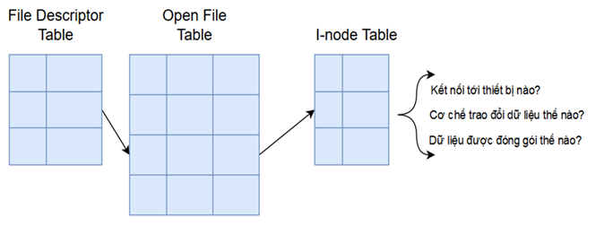
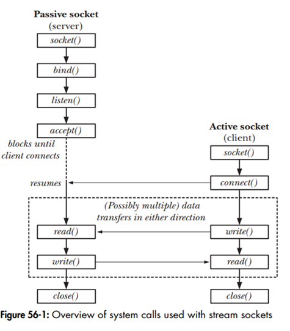
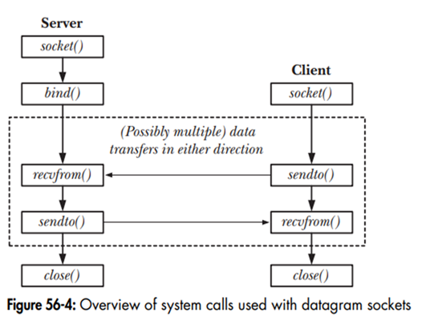

# Socket
## 1. Introduction to Sockets

### 1.1 Definition
- A **Socket** is a communication mechanism that allows processes to communicate with each other, whether they are running on the same device or on different devices.
- A socket is represented by a **file descriptor**.
- Sockets are used to transmit information within a file. This information includes:
  - **Domain**: The communication scope (Internet or UNIX).
  - **Type**: The socket type (Stream or Datagram).
  - **Protocol**: The protocol used (TCP, UDP, etc.).

<p align="center">
    
</p>
### 1.2 Domain
The domain defines the communication scope that the socket operates within:
- **Internet Domain**: Used for communication over the Internet, supporting:
  - IPv4 (`AF_INET`)
  - IPv6 (`AF_INET6`)
- **UNIX Domain**: Used for communication between processes on the same system (`AF_UNIX`).

**Illustration: Domain Hierarchy**

```
Domain
├── Unix Domain
└── Internet Domain
    ├── IPv4
    └── IPv6
```

### 1.3 Type
Sockets are categorized into two main types:
- **Stream Socket** (TCP):
  - Data is transmitted as a **byte stream**.
  - Ensures data is delivered in order, without loss, and includes error reporting.
- **Datagram Socket** (UDP):
  - Data is transmitted as **datagrams**.
  - Does not guarantee order, data may be lost, and there is no error reporting.

**Comparison Table: Stream Socket vs. Datagram Socket**

| **Criteria**              | **Stream Socket**                          | **Datagram Socket**                      |
|---------------------------|--------------------------------------------|------------------------------------------|
| **Characteristics**       | Ensures order, no data loss, error reporting | No order guarantee, possible data loss  |
| **Connection Requirement**| Requires connection setup                 | No connection setup required            |
| **Data Transmission**     | Byte stream                               | Datagram packets                        |

### 1.4 Protocol
- The protocol specifies the communication protocol used by the socket. Examples include:
  - `AF_INET` (IPv4 Internet protocols)
  - `AF_INET6` (IPv6 Internet protocols)
  - `AF_APPLETALK` (AppleTalk protocols)
  - `AF_PACKET` (Low-level packet interface)
- Each Domain and Type has a corresponding list of protocols. If no protocol is specified, the system selects a default protocol (typically 0).

**List of Common Protocols**

| **Name**    | **Purpose**                     | **Man Page** |
| ----------- | ------------------------------- | ------------ |
| `AF_UNIX`   | Local communication             | `unix(7)`    |
| `AF_INET`   | IPv4 Internet protocols         | `ip(7)`      |
| `AF_INET6`  | IPv6 Internet protocols         | `ipv6(7)`    |
| `AF_PACKET` | Low-level packet interface      | `packet(7)`  |
| `AF_RD`     | Reliable Datagram Sockets (RDS) | `rds(7)`     |

- In most cases, specifying 0 for the protocol parameter will select the default protocol for the chosen domain and type:
    - For AF_INET/SOCK_STREAM, the default is TCP.
    - For AF_INET/SOCK_DGRAM, the default is UDP.
	- For AF_UNIX sockets, the protocol is always 0.

### 1.5 File Descriptor, Open File Table, I-node Table
- **File Descriptor Table**: A table containing pointers to entries in the **Open File Table**.
- **Open File Table**: Stores information about open files, including their status and pointers to the **I-node Table**.
- **I-node Table**: Contains detailed file information (e.g., data location, read/write permissions, open/closed status, etc.).

**Illustration: Relationship Between File Descriptor, Open File Table, and I-node Table**

```
File Descriptor Table → Open File Table → I-node Table
```

- **Questions in the I-node Table**:
  - Which device is it connected to?
  - What are the read/write permissions?
  - Is the data closed or open?

---

## 2. Socket Workflow

### 2.1 Workflow of Stream Socket (TCP)
- **Stream Sockets** require a connection to be established before data transmission.
- The process initiating the connection is the **client**, while the process receiving the connection is the **server**.

**Workflow**

<p align="center">
    
</p>

### 2.2 Workflow of Datagram Socket (UDP)
- **Datagram Sockets** do not require a connection to be established; both the server and client can send/receive data immediately.

**Workflow**

<p align="center">
    
</p>

---

## 3. Sockets: Internet Domain Socket

### 3.1 Internet Socket Address
- The **Internet Socket Address** is defined by the `struct sockaddr` structure:
  - **Domain**: `AF_INET` (IPv4) or `AF_INET6` (IPv6).
  - Sockets use a single data type: `sockaddr`.

```c
struct sockaddr {
    sa_family_t sa_family;     /* address family, AF_xxx */
    char        sa_data[14];   /* 14 bytes of protocol address */
};
```

- To use the correct domain, the `struct sockaddr` must be cast to:
  - **IPv4**: `struct sockaddr_in`
  - **IPv6**: `struct sockaddr_in6`

#### 3.1.1 IPv4 Socket Address
Structure of `struct sockaddr_in`:
```c
struct sockaddr_in {
    sa_family_t sin_family;     // Address family (AF_INET)
    in_port_t sin_port;         // Port number
    struct in_addr sin_addr;    // IPv4 address
    unsigned char __pad[X];     // Padding to match the size of 16 bytes
};

struct in_addr {
    in_addr_t s_addr;           // IPv4 4-byte address (32-bit)
};
```

- Each IPv4 socket address consists of:
    + **sin_family:** Always set to AF_INET for IPv4 sockets.
    + **sin_port:** 16-bit port number in network byte order.
    + **sin_addr:** 32-bit IPv4 address in network byte order.
    + **__pad:** Padding bytes to ensure the structure size matches struct sockaddr.

- When working with IPv4 addresses, several special address values are commonly used:
    + **INADDR_ANY (0.0.0.0):** Binds a socket to all available network interfaces.
    + **INADDR_LOOPBACK (127.0.0.1):** Refers to the local loopback.
    + **INADDR_BROADCAST (255.255.255.255):** Used for broadcast messages.

#### 3.1.2 IPv6 Socket Address
Structure of `struct sockaddr_in6`:
```c
struct sockaddr_in6 {
    sa_family_t sin6_family;    // Address family (AF_INET6)
    in_port_t sin6_port;        // Port number
    uint32_t sin6_flowinfo;     // IPv6 flow information
    struct in6_addr sin6_addr;  // IPv6 address
    uint32_t sin6_scope_id;     // Scope ID (new in kernel 2.4)
};

struct in6_addr {
    uint8_t s6_addr[16];        // IPv6 16-byte address (128-bit)
};
```

- Each IPv6 socket address consists of:
    + **sin6_family:** Always set to AF_INET6 for IPv6 sockets.
    + **sin6_port:** 16-bit port number in network byte order.
    + **sin6_flowinfo:** Traffic class and flow information.
    + **sin6_addr:** 128-bit IPv6 address.
    + **sin6_scope_id:** Identifies the network interface for scope-limited addresses.
- Special IPv6 addresses include:
    + `in6addr_any (::)`: Binds to all interfaces.
    + `in6addr_loopback (::1)`: Refers to the local loopback interface.

### 3.2 Address Conversion for Sockets
- Internet Socket addresses are defined by an **IP address** and **port**, with data stored as **integers**.
- Different devices store data in different orders:
  - **Big-endian**: Most significant byte (MSB) is stored first.
  - **Little-endian**: Least significant byte (LSB) is stored first.
- Sockets use a common convention (typically **Big-endian**) to avoid conflicts.

**Illustration: Address Conversion**

| **Big-endian** (MSB → LSB) | **Little-endian** (LSB → MSB) |
|----------------------------|-------------------------------|
| N, N+1 (MSB, LSB)         | N, N+1 (LSB, MSB)            |

### 3.3 Functions Used for Address Conversion
Functions in `<arpa/inet.h>` are used to convert between **host byte order** and **network byte order**:

- **Convert from host to network byte order**:
  ```c
  #include <arpa/inet.h>
  uint16_t htons(uint16_t host_uint16);
  // Returns host_uint16 converted to network byte order

  uint32_t htonl(uint32_t host_uint32);
  // Returns host_uint32 converted to network byte order
  ```

- **Convert from network to host byte order**:
  ```c
  #include <arpa/inet.h>
  uint16_t ntohs(uint16_t net_uint16);
  // Returns net_uint16 converted to host byte order

  uint32_t ntohl(uint32_t net_uint32);
  // Returns net_uint32 converted to host byte order
  ```

- For working with human-readable IP address strings, Linux provides additional address conversion functions:
  ```c
  #include <arpa/inet.h>

  /* Convert string to binary address */
  int inet_pton(int af, const char *src, void *dst);

  /* Convert binary address to string */
  const char *inet_ntop(int af, const void *src, char *dst, socklen_t size);
  ```

#### TCP Server Example
```c
#include <stdio.h>
#include <stdlib.h>
#include <string.h>
#include <unistd.h>
#include <arpa/inet.h>
#include <sys/socket.h>

#define PORT 8080
#define BUFFER_SIZE 1024

int main() {
    int server_fd, client_fd;
    struct sockaddr_in server_addr, client_addr;
    socklen_t client_len = sizeof(client_addr);
    char buffer[BUFFER_SIZE];
    
    // Create socket
    if ((server_fd = socket(AF_INET, SOCK_STREAM, 0)) < 0) {
        perror("Socket creation failed");
        exit(EXIT_FAILURE);
    }
    
    // Set socket options to reuse address
    int opt = 1;
    if (setsockopt(server_fd, SOL_SOCKET, SO_REUSEADDR, &opt, sizeof(opt))) {
        perror("setsockopt failed");
        exit(EXIT_FAILURE);
    }
    
    // Configure server address
    memset(&server_addr, 0, sizeof(server_addr));
    server_addr.sin_family = AF_INET;
    server_addr.sin_addr.s_addr = htonl(INADDR_ANY);  // Accept connections on any interface
    server_addr.sin_port = htons(PORT);
    
    // Bind socket to address
    if (bind(server_fd, (struct sockaddr *)&server_addr, sizeof(server_addr)) < 0) {
        perror("Bind failed");
        exit(EXIT_FAILURE);
    }
    
    // Listen for connections
    if (listen(server_fd, 5) < 0) {
        perror("Listen failed");
        exit(EXIT_FAILURE);
    }
    
    printf("Server listening on port %d\n", PORT);
    
    // Accept and handle connections
    while (1) {
        if ((client_fd = accept(server_fd, (struct sockaddr *)&client_addr, &client_len)) < 0) {
            perror("Accept failed");
            continue;
        }
        
        // Convert client IP to string for display
        char client_ip[INET_ADDRSTRLEN];
        inet_ntop(AF_INET, &client_addr.sin_addr, client_ip, INET_ADDRSTRLEN);
        printf("Client connected: %s:%d\n", client_ip, ntohs(client_addr.sin_port));
        
        // Read data from client
        ssize_t bytes_read = recv(client_fd, buffer, BUFFER_SIZE - 1, 0);
        if (bytes_read > 0) {
            buffer[bytes_read] = '\0';
            printf("Received: %s\n", buffer);
            
            // Echo back to client
            send(client_fd, buffer, bytes_read, 0);
        }
        
        close(client_fd);
    }
    
    close(server_fd);
    return 0;
}
```

#### TCP Client Example
```c
#include <stdio.h>
#include <stdlib.h>
#include <string.h>
#include <unistd.h>
#include <arpa/inet.h>
#include <sys/socket.h>

#define PORT 8080
#define BUFFER_SIZE 1024

int main() {
    int sock_fd;
    struct sockaddr_in server_addr;
    char buffer[BUFFER_SIZE];
    
    // Create socket
    if ((sock_fd = socket(AF_INET, SOCK_STREAM, 0)) < 0) {
        perror("Socket creation failed");
        exit(EXIT_FAILURE);
    }
    
    // Configure server address
    memset(&server_addr, 0, sizeof(server_addr));
    server_addr.sin_family = AF_INET;
    server_addr.sin_port = htons(PORT);
    
    // Convert IPv4 address from text to binary
    if (inet_pton(AF_INET, "127.0.0.1", &server_addr.sin_addr) <= 0) {
        perror("Invalid address");
        exit(EXIT_FAILURE);
    }
    
    // Connect to server
    if (connect(sock_fd, (struct sockaddr *)&server_addr, sizeof(server_addr)) < 0) {
        perror("Connection failed");
        exit(EXIT_FAILURE);
    }
    
    printf("Connected to server. Enter message: ");
    fgets(buffer, BUFFER_SIZE, stdin);
    
    // Remove newline character
    size_t len = strlen(buffer);
    if (len > 0 && buffer[len-1] == '\n')
        buffer[--len] = '\0';
    
    // Send message to server
    send(sock_fd, buffer, len, 0);
    printf("Message sent\n");
    
    // Receive response
    ssize_t bytes_read = recv(sock_fd, buffer, BUFFER_SIZE - 1, 0);
    buffer[bytes_read] = '\0';
    printf("Server response: %s\n", buffer);
    
    close(sock_fd);
    return 0;
}
```

#### UDP Server Example
```c
#include <stdio.h>
#include <stdlib.h>
#include <string.h>
#include <unistd.h>
#include <arpa/inet.h>
#include <sys/socket.h>

#define PORT 8080
#define BUFFER_SIZE 1024

int main() {
    int server_fd;
    struct sockaddr_in server_addr, client_addr;
    socklen_t client_len = sizeof(client_addr);
    char buffer[BUFFER_SIZE];
    
    // Create UDP socket
    if ((server_fd = socket(AF_INET, SOCK_DGRAM, 0)) < 0) {
        perror("Socket creation failed");
        exit(EXIT_FAILURE);
    }
    
    // Configure server address
    memset(&server_addr, 0, sizeof(server_addr));
    server_addr.sin_family = AF_INET;
    server_addr.sin_addr.s_addr = htonl(INADDR_ANY);
    server_addr.sin_port = htons(PORT);
    
    // Bind socket to address
    if (bind(server_fd, (struct sockaddr *)&server_addr, sizeof(server_addr)) < 0) {
        perror("Bind failed");
        exit(EXIT_FAILURE);
    }
    
    printf("UDP server listening on port %d\n", PORT);
    
    // Receive and respond to datagrams
    while (1) {
        ssize_t bytes_read = recvfrom(server_fd, buffer, BUFFER_SIZE - 1, 0,
                                     (struct sockaddr *)&client_addr, &client_len);
        
        if (bytes_read > 0) {
            buffer[bytes_read] = '\0';
            
            // Convert client IP to string for display
            char client_ip[INET_ADDRSTRLEN];
            inet_ntop(AF_INET, &client_addr.sin_addr, client_ip, INET_ADDRSTRLEN);
            printf("Received from %s:%d: %s\n", 
                   client_ip, ntohs(client_addr.sin_port), buffer);
            
            // Echo back to client
            sendto(server_fd, buffer, bytes_read, 0,
                  (struct sockaddr *)&client_addr, client_len);
        }
    }
    
    close(server_fd);
    return 0;
}
```

#### UDP Client Example
```c
#include <stdio.h>
#include <stdlib.h>
#include <string.h>
#include <unistd.h>
#include <arpa/inet.h>
#include <sys/socket.h>

#define PORT 8080
#define BUFFER_SIZE 1024

int main() {
    int sock_fd;
    struct sockaddr_in server_addr;
    socklen_t server_len = sizeof(server_addr);
    char buffer[BUFFER_SIZE];
    
    // Create UDP socket
    if ((sock_fd = socket(AF_INET, SOCK_DGRAM, 0)) < 0) {
        perror("Socket creation failed");
        exit(EXIT_FAILURE);
    }
    
    // Configure server address
    memset(&server_addr, 0, sizeof(server_addr));
    server_addr.sin_family = AF_INET;
    server_addr.sin_port = htons(PORT);
    
    // Convert IPv4 address from text to binary
    if (inet_pton(AF_INET, "127.0.0.1", &server_addr.sin_addr) <= 0) {
        perror("Invalid address");
        exit(EXIT_FAILURE);
    }
    
    printf("Enter message: ");
    fgets(buffer, BUFFER_SIZE, stdin);
    
    // Remove newline character
    size_t len = strlen(buffer);
    if (len > 0 && buffer[len-1] == '\n')
        buffer[--len] = '\0';
    
    // Send message to server
    sendto(sock_fd, buffer, len, 0, 
          (struct sockaddr *)&server_addr, server_len);
    printf("Message sent\n");
    
    // Receive response
    ssize_t bytes_read = recvfrom(sock_fd, buffer, BUFFER_SIZE - 1, 0,
                                 (struct sockaddr *)&server_addr, &server_len);
    buffer[bytes_read] = '\0';
    printf("Server response: %s\n", buffer);
    
    close(sock_fd);
    return 0;
}
```

---

## 4. Sockets: Unix Domain Socket

### 4.1 Unix Socket Address
- **Unix Sockets** facilitate communication between processes on the same device but cannot transmit data over a network like Internet Sockets.
- **Domain**: `AF_UNIX`.
- **Type**: Supports two socket types:
  - `SOCK_STREAM` (stream - TCP)
  - `SOCK_DGRAM` (datagram - UDP)
- **Protocol**: Always 0, e.g., `socket(AF_UNIX, SOCK_STREAM, 0)`.

#### Unix Socket Address Structure
- After calling `bind()` to assign an address to the socket, a socket file is created based on the `path_name`:
  ```c
  struct sockaddr_un {
      sa_family_t sun_family;     // Always AF_UNIX
      char sun_path[108];         // Null-terminated socket pathname
  };
  ```

#### Key Notes
- A socket cannot be bound to a `path_name` that already exists.
- The `path_name` can be:
  - An absolute path (`/home/user/socket`)
  - A relative path (`./socket`)
- Although a socket is represented by a socket file, it cannot be opened using `open()` to establish a connection.
- After the socket is closed or the program terminates, the `path_name` file persists. To remove it, use `unlink()` or `remove()`.

#### Access Permissions
- To connect or send data to a socket, the process must have **write** permissions for the `path_name` file.
- The `bind()` command creates the socket file with permissions determined by `umask()`, or permissions can be modified by changing the directory containing the socket file.

### 4.2. Socket File Management
-  When binding a Unix Domain Socket:
    + A special socket file is created at the specified pathname.
    + The file appears in the filesystem but **cannot be accessed with regular file operations**.
    + The pathname must not already exist when binding.
    + The socket file persists even after the socket is closed or the program terminates.
    + Manual cleanup with `unlink()` is required.
    
```c
// Create and bind socket
int sockfd = socket(AF_UNIX, SOCK_STREAM, 0);
struct sockaddr_un addr;
addr.sun_family = AF_UNIX;
strcpy(addr.sun_path, "/tmp/my_socket");

// Remove any existing socket file first
unlink("/tmp/my_socket");

// Bind socket to address
bind(sockfd, (struct sockaddr*)&addr, sizeof(addr));

// When done, clean up
close(sockfd);
unlink("/tmp/my_socket");
```

### 4.3. Access Control and Security
- Unix Domain Sockets use filesystem permissions for access control, making them more secure than other IPC mechanisms:
    + **Connection/Send:** Requires write permission on the socket file.
    + **Receive:** Requires read permission on the socket file.
    + Access can be restricted to specific users or groups, unlike TCP ports which are typically accessible system-wide.
- Permission control methods:
```c
// Using umask before binding
mode_t old_mask = umask(077);  // Only allow owner access
bind(sockfd, (struct sockaddr*)&addr, sizeof(addr));
umask(old_mask);

// Using chmod after binding
bind(sockfd, (struct sockaddr*)&addr, sizeof(addr));
chmod("/tmp/my_socket", S_IRUSR | S_IWUSR);  // Read/write for owner only
```

### 4.4. Peer Credentials
- Unix Domain Sockets allow processes to securely identify who is connecting to them:
```c
struct ucred {
    pid_t pid;    /* Process ID of the sending process */
    uid_t uid;    /* User ID of the sending process */
    gid_t gid;    /* Group ID of the sending process */
};

// Get credentials of connected peer
struct ucred cred;
socklen_t len = sizeof(cred);
getsockopt(client_fd, SOL_SOCKET, SO_PEERCRED, &cred, &len);
printf("Connected process: PID=%d, UID=%d, GID=%d\n", 
       cred.pid, cred.uid, cred.gid);
```

### 4.5. Server/Client Model

#### 4.5.1. Stream Socket (Connection-Oriented) Communication

Stream sockets in the Unix domain provide reliable, connection-oriented communication similar to TCP but with better performance for local inter-process communication. The communication follows the traditional client-server model:

1. Server creates a socket, binds it to a pathname, and listens for connections
2. Client creates a socket and connects to the server's pathname
3. Server accepts the connection, creating a new socket dedicated to this client
4. Data exchange occurs through this dedicated connection
5. Either side can close the connection when finished

##### Stream Socket Server Example
```c
#include <stdio.h>
#include <stdlib.h>
#include <string.h>
#include <unistd.h>
#include <sys/socket.h>
#include <sys/un.h>
#include <sys/stat.h>

#define SOCKET_PATH "/tmp/example_socket"
#define BUFFER_SIZE 1024

int main() {
    int server_fd, client_fd;
    struct sockaddr_un server_addr, client_addr;
    socklen_t client_len;
    char buffer[BUFFER_SIZE];
    
    // Step 1: Create a stream socket in the Unix domain
    if ((server_fd = socket(AF_UNIX, SOCK_STREAM, 0)) == -1) {
        perror("socket creation failed");
        exit(EXIT_FAILURE);
    }
    
    // Step 2: Setup server address structure with the socket path
    memset(&server_addr, 0, sizeof(server_addr));
    server_addr.sun_family = AF_UNIX;
    strncpy(server_addr.sun_path, SOCKET_PATH, sizeof(server_addr.sun_path) - 1);
    
    // Step 3: Remove any existing socket file (important to avoid "Address already in use" error)
    unlink(SOCKET_PATH);
    
    // Step 4: Bind the socket to the address
    if (bind(server_fd, (struct sockaddr*)&server_addr, sizeof(server_addr)) == -1) {
        perror("bind failed");
        close(server_fd);
        exit(EXIT_FAILURE);
    }
    
    // Step 5: Set socket file permissions (read/write for owner and group)
    chmod(SOCKET_PATH, S_IRUSR | S_IWUSR | S_IRGRP | S_IWGRP);  // 0660 permissions
    
    // Step 6: Listen for incoming connections (backlog of 5)
    if (listen(server_fd, 5) == -1) {
        perror("listen failed");
        close(server_fd);
        unlink(SOCKET_PATH);
        exit(EXIT_FAILURE);
    }
    
    printf("Server listening on %s\n", SOCKET_PATH);
    
    // Main server loop
    while (1) {
        // Step 7: Accept a new client connection
        client_len = sizeof(client_addr);
        if ((client_fd = accept(server_fd, (struct sockaddr*)&client_addr, &client_len)) == -1) {
            perror("accept failed");
            continue;  // Continue listening even if this accept fails
        }
        
        printf("Client connected\n");
        
        // Step 8: Get client process credentials (a unique feature of Unix domain sockets)
        struct ucred cred;
        socklen_t len = sizeof(cred);
        if (getsockopt(client_fd, SOL_SOCKET, SO_PEERCRED, &cred, &len) == -1) {
            perror("getsockopt failed");
        } else {
            printf("Client process details - PID: %d, UID: %d, GID: %d\n", 
                   cred.pid, cred.uid, cred.gid);
        }
        
        // Step 9: Communication loop - receive and echo data
        ssize_t bytes_read;
        while ((bytes_read = recv(client_fd, buffer, BUFFER_SIZE - 1, 0)) > 0) {
            buffer[bytes_read] = '\0';  // Null-terminate the received data
            printf("Received: %s\n", buffer);
            
            // Echo the data back to the client
            send(client_fd, buffer, bytes_read, 0);
        }
        
        // Check for receive error
        if (bytes_read == -1) {
            perror("recv failed");
        }
        
        // Step 10: Close the client connection
        close(client_fd);
        printf("Client disconnected\n");
    }
    
    // Cleanup resources (normally unreachable in this example)
    close(server_fd);
    unlink(SOCKET_PATH);
    return 0;
}
```

##### Stream Socket Client Example
```c
#include <stdio.h>
#include <stdlib.h>
#include <string.h>
#include <unistd.h>
#include <sys/socket.h>
#include <sys/un.h>

#define SOCKET_PATH "/tmp/example_socket"
#define BUFFER_SIZE 1024

int main() {
    int client_fd;
    struct sockaddr_un server_addr;
    char buffer[BUFFER_SIZE];
    
    // Step 1: Create a stream socket in the Unix domain
    if ((client_fd = socket(AF_UNIX, SOCK_STREAM, 0)) == -1) {
        perror("socket creation failed");
        exit(EXIT_FAILURE);
    }
    
    // Step 2: Setup server address structure with the socket path
    memset(&server_addr, 0, sizeof(server_addr));
    server_addr.sun_family = AF_UNIX;
    strncpy(server_addr.sun_path, SOCKET_PATH, sizeof(server_addr.sun_path) - 1);
    
    // Step 3: Connect to the server
    if (connect(client_fd, (struct sockaddr*)&server_addr, sizeof(server_addr)) == -1) {
        perror("connect failed");
        close(client_fd);
        exit(EXIT_FAILURE);
    }
    
    printf("Connected to server. Type messages (Ctrl+D to quit):\n");
    
    // Step 4: Communication loop - send and receive data
    while (fgets(buffer, BUFFER_SIZE, stdin) != NULL) {
        // Remove newline character
        size_t len = strlen(buffer);
        if (len > 0 && buffer[len-1] == '\n') {
            buffer[len-1] = '\0';
            len--;
        }
        
        // Send the message to the server
        if (send(client_fd, buffer, len, 0) == -1) {
            perror("send failed");
            break;
        }
        
        // Receive the echo response
        ssize_t bytes_read = recv(client_fd, buffer, BUFFER_SIZE - 1, 0);
        if (bytes_read <= 0) {
            if (bytes_read < 0)
                perror("recv failed");
            else
                printf("Server closed connection\n");
            break;
        }
        
        // Display the echo response
        buffer[bytes_read] = '\0';
        printf("Server echo: %s\n", buffer);
    }
    
    // Step 5: Close the connection
    close(client_fd);
    return 0;
}
```

#### 4.5.2. Datagram Socket (Connectionless) Communication

Datagram sockets in the Unix domain provide connectionless communication similar to UDP but for local processes. Key characteristics include:

1. No formal connection is established
2. Both sides create sockets and bind them to pathnames
3. Messages are sent directly to the recipient's pathname
4. Each message is self-contained and independent
5. No guarantee of message delivery or ordering

##### Datagram Socket Server Example
```c
#include <stdio.h>
#include <stdlib.h>
#include <string.h>
#include <unistd.h>
#include <sys/socket.h>
#include <sys/un.h>

#define SERVER_PATH "/tmp/dgram_server_socket"
#define BUFFER_SIZE 1024

int main() {
    int server_fd;
    struct sockaddr_un server_addr, client_addr;
    socklen_t client_len;
    char buffer[BUFFER_SIZE];

    // Step 1: Create a datagram socket in the Unix domain
    if ((server_fd = socket(AF_UNIX, SOCK_DGRAM, 0)) == -1) {
        perror("socket creation failed");
        exit(EXIT_FAILURE);
    }

    // Step 2: Setup server address structure with the socket path
    memset(&server_addr, 0, sizeof(server_addr));
    server_addr.sun_family = AF_UNIX;
    strncpy(server_addr.sun_path, SERVER_PATH, sizeof(server_addr.sun_path) - 1);

    // Step 3: Remove any existing socket file
    unlink(SERVER_PATH);

    // Step 4: Bind the socket to the address
    if (bind(server_fd, (struct sockaddr*)&server_addr, sizeof(server_addr)) == -1) {
        perror("bind failed");
        close(server_fd);
        exit(EXIT_FAILURE);
    }

    printf("Datagram server listening on %s\n", SERVER_PATH);

    // Step 5: Receive and process datagrams
    while (1) {
        client_len = sizeof(client_addr);
        
        // Receive a datagram and capture the sender's address
        ssize_t bytes_read = recvfrom(server_fd, buffer, BUFFER_SIZE - 1, 0,
                                      (struct sockaddr*)&client_addr, &client_len);

        if (bytes_read == -1) {
            perror("recvfrom failed");
            continue;
        }

        // Process the received data
        buffer[bytes_read] = '\0';
        printf("Received datagram: %s\n", buffer);
        
        // The client_addr now contains the address to reply to
        printf("Replying to client at: %s\n", 
               client_addr.sun_path[0] ? client_addr.sun_path : "anonymous client");

        // Echo the data back to the client
        if (sendto(server_fd, buffer, bytes_read, 0,
                   (struct sockaddr*)&client_addr, client_len) == -1) {
            perror("sendto failed");
        }
    }

    // Cleanup resources (normally unreachable in this example)
    close(server_fd);
    unlink(SERVER_PATH);
    return 0;
}
```

##### Datagram Socket Client Example
```c
#include <stdio.h>
#include <stdlib.h>
#include <string.h>
#include <unistd.h>
#include <sys/socket.h>
#include <sys/un.h>

#define SERVER_PATH "/tmp/dgram_server_socket"
#define CLIENT_PATH "/tmp/dgram_client_socket"
#define BUFFER_SIZE 1024

int main() {
    int client_fd;
    struct sockaddr_un server_addr, client_addr;
    char buffer[BUFFER_SIZE];

    // Step 1: Create a datagram socket in the Unix domain
    if ((client_fd = socket(AF_UNIX, SOCK_DGRAM, 0)) == -1) {
        perror("socket creation failed");
        exit(EXIT_FAILURE);
    }

    // Step 2: Setup client address for receiving replies
    memset(&client_addr, 0, sizeof(client_addr));
    client_addr.sun_family = AF_UNIX;
    strncpy(client_addr.sun_path, CLIENT_PATH, sizeof(client_addr.sun_path) - 1);

    // Step 3: Remove any existing socket file
    unlink(CLIENT_PATH);

    // Step 4: Bind the socket to the client address
    // (This is required for receiving replies in datagram sockets)
    if (bind(client_fd, (struct sockaddr*)&client_addr, sizeof(client_addr)) == -1) {
        perror("bind failed");
        close(client_fd);
        exit(EXIT_FAILURE);
    }

    // Step 5: Setup server address for sending messages
    memset(&server_addr, 0, sizeof(server_addr));
    server_addr.sun_family = AF_UNIX;
    strncpy(server_addr.sun_path, SERVER_PATH, sizeof(server_addr.sun_path) - 1);

    // Step 6: Get user input
    printf("Enter message to send to server: ");
    fgets(buffer, BUFFER_SIZE, stdin);
    
    // Remove newline character
    buffer[strcspn(buffer, "\n")] = '\0';  // strcspn finds position of \n

    // Step 7: Send datagram to server
    if (sendto(client_fd, buffer, strlen(buffer), 0,
               (struct sockaddr*)&server_addr, sizeof(server_addr)) == -1) {
        perror("sendto failed");
        close(client_fd);
        unlink(CLIENT_PATH);
        exit(EXIT_FAILURE);
    }
    
    printf("Message sent to server\n");

    // Step 8: Receive reply from server
    socklen_t server_len = sizeof(server_addr);
    ssize_t bytes_received = recvfrom(client_fd, buffer, BUFFER_SIZE - 1, 0,
                                     (struct sockaddr*)&server_addr, &server_len);
                                     
    if (bytes_received == -1) {
        perror("recvfrom failed");
    } else {
        buffer[bytes_received] = '\0';
        printf("Server response: %s\n", buffer);
    }

    // Step 9: Cleanup resources
    close(client_fd);
    unlink(CLIENT_PATH);
    return 0;
}
```


---

## Summary
- **Sockets** are a network communication tool, supporting both **Internet Domain** (TCP/UDP) and **Unix Domain**.
- **Internet Sockets**:
  - Support IPv4 (`AF_INET`) and IPv6 (`AF_INET6`).
  - Require address conversion between host and network byte order (using `htons`, `ntohl`, etc.).
- **Unix Sockets**:
  - Used for communication on the same device (`AF_UNIX`).
  - Use `struct sockaddr_un` to assign addresses via `path_name`.
- **Workflow**:
  - Stream Socket (TCP): Requires a connection setup.
  - Datagram Socket (UDP): Does not require a connection setup.

---

- **Previous lecture**: [Thread](05.%20Thread.md)
- **Next lecture:** [Pipes and FIFOs](07.%20Pipes%20and%20FIFOs.md)