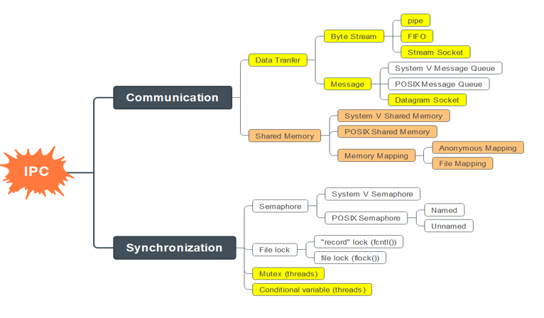

# 11. Summary
Inter-Process Communication (IPC) is a cornerstone in Embedded Linux for enabling processes to communicate and synchronize effectively. Based on the diagram, IPC is divided into **Communication** and **Synchronization**. Below are comparison tables to help you choose the right mechanism for your needs.

    
     
	<em>Figure: Illustrates a sample IPC flow, showing a sender process communicating with a receiver via a message queue or pipe.</em>

## 1. Communication
These mechanisms facilitate data transfer between processes, categorized into **Data Transfer** and **Shared Memory**.

### 1.1. Data Transfer
| **Mechanism**         | **Advantages**                                                              | **Disadvantages**                                      | **Use Case**                                   |
|-----------------------|-----------------------------------------------------------------------------|-------------------------------------------------------|-----------------------------------------------|
| **Pipe**              | - Simple, easy to use. - Ideal for parent-child communication.           | - Supports only one-way communication. - Not persistent. | Small data transfer between related processes (parent-child). |
| **FIFO**              | - Supports communication between unrelated processes. - Easy to scale.  | - Requires file system management. - Slower than Pipe. | Sequential data transfer between unrelated processes. |
| **Stream Socket**     | - Reliable (TCP). - Supports network communication.                      | - Higher resource overhead. - Greater latency.     | Communication between processes over a network or on the same machine. |
| **Datagram Socket**   | - Fast (UDP). - Connectionless.                                          | - No guarantee of delivery or order.                  | Fast data transfer where reliability isn’t critical. |
| **System V Message Queue** | - Supports structured messages. - Allows message prioritization.      | - More complex API. - Lower performance than POSIX MQ. | Sending prioritized messages between processes. |
| **POSIX Message Queue** | - Simpler API than System V. - Supports non-blocking communication.   | - Requires careful resource management.              | Flexible, high-performance message passing.   |

### 1.2. Shared Memory
| **Mechanism**              | **Advantages**                                                       | **Disadvantages**                                                   | **Use Case**                                          |
| -------------------------- | -------------------------------------------------------------------- | ------------------------------------------------------------------- | ----------------------------------------------------- |
| **System V Shared Memory** | - High performance. - Suitable for large data.                    | - Requires synchronization (Semaphore). - Complex API.           | Sharing large data between processes.                 |
| **POSIX Shared Memory**    | - Modern, simpler API than System V. - More flexible.             | - Needs separate synchronization. - Complex resource management. | High-performance data sharing with easier management. |
| **Anonymous Mapping**      | - No file system required. - Good for parent-child processes.     | - Not usable for unrelated processes.                               | Data sharing between related processes.               |
| **File Mapping**           | - Persistent storage in a file. - Easy to share across processes. | - Slower than Anonymous Mapping.                                    | Sharing data that needs long-term persistence.        |

## 2. Synchronization
These mechanisms ensure processes access shared resources without conflicts.

| **Mechanism**         | **Advantages**                                                              | **Disadvantages**                                      | **Use Case**                                   |
|-----------------------|-----------------------------------------------------------------------------|-------------------------------------------------------|-----------------------------------------------|
| **System V Semaphore** | - Supports multiple semaphores in a set. - Suitable for legacy systems. | - Complex API. - Difficult resource management.   | Synchronizing multiple processes with Shared Memory. |
| **POSIX Semaphore**   | - Supports Named and Unnamed. - Simpler API than System V.              | - Requires careful resource management (Named).      | Synchronizing processes or threads, easy to scale. |
| **File Lock (fcntl/flock)** | - Easy to use with files. - Supports partial locking (record lock).   | - Lower performance than semaphores. - File-dependent. | Synchronizing file access between processes. |
| **Mutex (threads)**   | - Fast, lightweight. - Ideal for thread synchronization within a process. | - Only for threads, not processes.                  | Synchronizing threads within the same process. |
| **Conditional Variable (threads)** | - Supports signaling between threads. - Flexible with conditions.   | - Only for threads. - Requires Mutex pairing.     | Synchronizing threads with specific conditions (e.g., waiting for data). |

## Conclusion
- **Communication**: Opt for **POSIX Message Queue** for efficient message passing, or **POSIX Shared Memory** for high-performance large data sharing.
- **Synchronization**: Use **POSIX Semaphore** for process synchronization, or **Mutex**/**Conditional Variable** for threads within a process.

---

- **Previous lecture**: [Semaphore](10.%20Semaphore.md)

